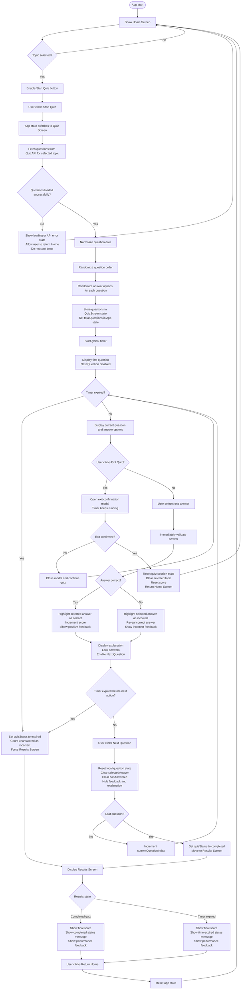

# Quiz App User Flow

```mermaid
flowchart TD
    A([App start]) --> B[Show Home Screen]
    B --> C{Topic selected?}
    C -- No --> B
    C -- Yes --> D[Enable Start Quiz button]
    D --> E[User clicks Start Quiz]
    E --> F[App state switches to Quiz Screen]
    F --> G[Fetch questions from QuizAPI for selected topic]
    G --> H{Questions loaded successfully?}
    H -- No --> I[Show loading or API error state<br/>Allow user to return Home<br/>Do not start timer]
    I --> B
    H -- Yes --> J[Normalize question data]
    J --> K[Randomize question order]
    K --> L[Randomize answer options for each question]
    L --> M[Store questions in QuizScreen state<br/>Set totalQuestions in App state]
    M --> N[Start global timer]
    N --> O[Display first question<br/>Next Question disabled]

    O --> P{Timer expired?}
    P -- Yes --> Q[Set quizStatus to expired<br/>Count unanswered as incorrect<br/>Force Results Screen]
    P -- No --> R[Display current question and answer options]

    R --> S{User clicks Exit Quiz?}
    S -- Yes --> T[Open exit confirmation modal<br/>Timer keeps running]
    T --> U{Exit confirmed?}
    U -- No --> V[Close modal and continue quiz]
    V --> P
    U -- Yes --> W[Reset quiz session state<br/>Clear selected topic<br/>Reset score<br/>Return Home Screen]
    W --> B
    S -- No --> X[User selects one answer]

    X --> Y[Immediately validate answer]
    Y --> Z{Answer correct?}
    Z -- Yes --> AA[Highlight selected answer as correct<br/>Increment score<br/>Show positive feedback]
    Z -- No --> AB[Highlight selected answer as incorrect<br/>Reveal correct answer<br/>Show incorrect feedback]
    AA --> AC[Display explanation<br/>Lock answers<br/>Enable Next Question]
    AB --> AC
    AC --> AD{Timer expired before next action?}
    AD -- Yes --> Q
    AD -- No --> AE[User clicks Next Question]
    AE --> AF[Reset local question state<br/>Clear selectedAnswer<br/>Clear hasAnswered<br/>Hide feedback and explanation]
    AF --> AG{Last question?}
    AG -- No --> AH[Increment currentQuestionIndex]
    AH --> P
    AG -- Yes --> AI[Set quizStatus to completed<br/>Move to Results Screen]

    Q --> AJ[Display Results Screen]
    AI --> AJ
    AJ --> AK{Results state}
    AK -- Completed quiz --> AL[Show final score<br/>Show completed status message<br/>Show performance feedback]
    AK -- Timer expired --> AM[Show final score<br/>Show time expired status message<br/>Show performance feedback]
    AL --> AN[User clicks Return Home]
    AM --> AN
    AN --> AO[Reset app state]
    AO --> B
```
